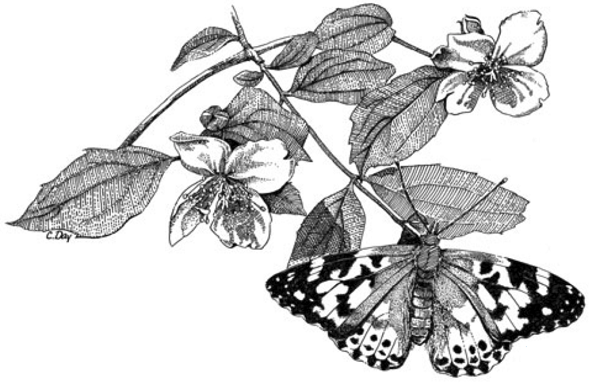

<figure class="figure text-right">
<h3 class="text-right">Companion Website&nbsp;to Biology 115 
Laboratory Manual</h3>
<h4 class="text-left">Fall 2018</h4>
  
  <figcaption class="figure-caption text-right">Illustration by Cindy Day.</figcaption>
</figure>

Welcome to the companion website for Organismal Biology Lab (BIOL 115L) at 
Minnesota State University Moorhead.

Here you can find the two Data Labs you will do in class, and links to sign-up sheets for bird banding sessions.

## Pages

- [Data Lab 1](lab1.html)
- [Data Lab 2](lab2.html)
- [Bird Banding](bird_banding.html)
- [Friday Research Exploration & Education](free.html)