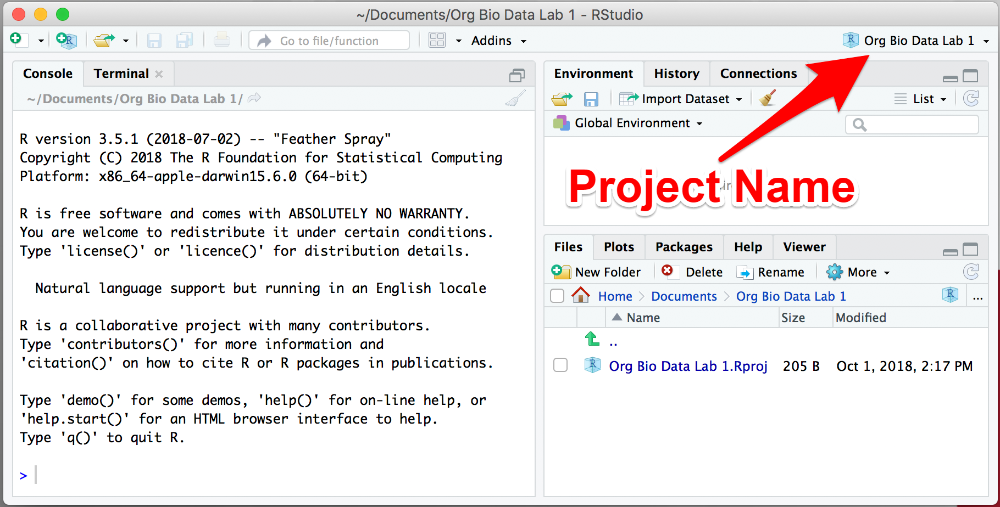

<ul class="pager">
  <li class="next"><a href="lab1_2_calc.html">Part 2. R as a Calculator &rarr;</a></li>
</ul>

In Part 1 of this lab, you will learn what R and RStudio are, how the RStudio environment is organized, and how RStudio organizes your work into Projects. To finish, you will create your first RStudio Project, which you will continue to work in for the rest of the lab.

Sections:

- [Access the Class Share drive]
- [R and RStudio]
- [Create an RStudio project]
- [Practice opening and closing]

### Access the Class Share drive

We will use a Class Share drive to save files for the data labs. 

Unlike files saved on your lab computer, which are deleted after you sign out, files on Class Share stay there until the course ends and are available from any computer on campus.

To connect to the Class Share drive: 

- On a Mac computer you can connect to the drive using these instructions:
    - In the Finder, choose Go > Connect to Server or type Command+K
    - Enter the server path of smb://msumstudents.mnstate.edu/classshare
    - Click the "Connect" button
- On a Windows computer you can map a drive using these instructions: https://support.microsoft.com/en-us/help/4026635/windows-map-a-network-drive
    - The path you would use for the class share drive is \\msumstudents.mnstate.edu\classshare
    - You may use any drive letter you would like as long as it is available

***Note: In order to connect to the servers on either platform you must be on the Campus Network, DragonConnect-Employee or DragonConnect-Student wifi for it to work.

Once you are connected, you should see "classshare" as a location in the Finder on a Mac, or under My Computer on Windows.

### R and RStudio

R is a programming language and free software environment for statistical computing and graphics supported by the R Foundation for Statistical Computing. Today, R is the most commonly used software for data analysis in the biological sciences.

While it is possible to run R by itself, it is more common to run it as part of RStudio, a free and open-source integrated development environment (IDE) for R.

Both R and RStudio are already installed on your lab computer. If you ever need to install them, for example on your personal computer, you can download installers here:

- R   https://cloud.r-project.org/
- RStudio   https://www.rstudio.com/products/rstudio/download/

For this lab, you will be using RStudio rather than R directly.

### Create an RStudio project

RStudio projects make it straightforward to divide your work into multiple contexts, each with their own working directory, workspace, history, and source documents (scripts), and data files.

To start RStudio on a Mac, open the Finder, go to Applications, and scroll down to find RStudio.

<figure class="figure">
  
  <figcaption class="figure-caption">Starting RStudio in Mac OS</figcaption>
</figure>

Create a new project using the **New Project...** command available under the File menu or the Project menu. The Project menu is on right side of the global toolbar and will either say **Project: (none)** if there is no project open (the default), or it will show the name of the currently open project.

<figure class="figure">
  
  <figcaption class="figure-caption">Use the <strong>New Project...</strong> command to create a new project.</figcaption>
</figure>

This will bring up a dialog box. Select **New Directory**:

<figure class="figure">
  
  <figcaption class="figure-caption">Select <strong>New Directory</strong>.</figcaption>
</figure>

And then click **New Project**:

<figure class="figure">
  
  <figcaption class="figure-caption">Select <strong>New Project</strong>.</figcaption>
</figure>

On the next screen, you will be prompted to enter a **Directory name**. Type "Data Lab 1" here (or something equally descriptive, so you can find it later).

Under **Create project as a subdirectory of**, click the **Browse** button and navigate to YOUR FOLDER in the Class Share drive and click "Select".

The box show now say something Like:

- `Volumes/classshare/BIOL115L-01/Projects/starid/` on a Mac
- or `K:/BIOL115L-01/starid/` on a PC

... where `starid` is your 8-character StarID, `01` is your 2-digit section number, and `K` is the mapped drive letter on a PC.

On a Mac, it should look like this:

<figure class="figure">
  
  <figcaption class="figure-caption">Enter a name for your project under <strong>Directory Name</strong> and use the <strong>Browse</strong> button to select your Class Share directory.</figcaption>
</figure>

Now click the **Create Project** button. Your new project will be created and will open in a new window.

When a new project is created RStudio:

1. Creates a project file (with an .Rproj extension) within the project directory. This file contains various project options (discussed below) and can also be used as a shortcut for opening the project directly from the filesystem.
2. Creates a hidden directory (named .Rproj.user) where project-specific temporary files are stored. You don't need to worry about this.
3. Loads the project into RStudio and display its name in the Projects toolbar (which is located on the far right side of the main toolbar)

### Practice opening and closing

Quit RStudio by clicking the X button to close the window, going to File > Quit Session, or typing Cmd+Q.

Restart RStudio and it should open the most recent project. This won't happen when you start RStudio on another computer or after logging out of this computer.

To open the project on a new computer:
1. [Access the Class Share drive]
2. Open your **Data Lab 1** folder
3. Double click the file named **Data Lab 1**

RStudio will start and open your project automaticaly. The window should look like this, with your project name in the upper right corner:

<figure class="figure">
  
  <figcaption class="figure-caption">Always make sure the name of your project is showing here. If it is not, click the menu to open your project. Working in RStudio without your project open can cause unexpected errors.</figcaption>
</figure>

Warning If you don't see your project name, but do see the words **Project: (None)** then you do not have a project open. This is a problem because any R code you run may not run correctly, especially reading data into R. The most common way for this situation to arise is if you navigate to your project directory and try to open RStudio by clicking on an R script (more on those later), which opens the R script but not the project. If you see **Project: (None)** then you should immediately open your project by clicking **Open Project...* like this:

<figure class="figure">
  
  <figcaption class="figure-caption">Open a project using the Project menu.</figcaption>
</figure>

Once you feel confident creating and opening projects, you can move on to Part 2.

<ul class="pager">
  <li class="next"><a href="lab1_2_calc.html">Part 2. R as a Calculator &rarr;</a></li>
</ul>